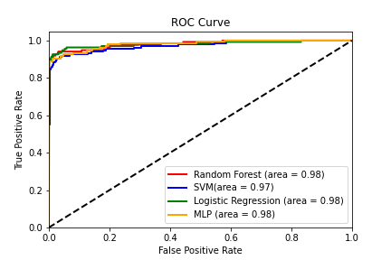

## Fraud model
Данная представляет собой модель работу по построению модели машинного обучения. 

Так же в этой работе предоставлен jupyter notebook, где было проведено сравнение разных алгоритмов машинного обучения.

Был проведен первичный анализ данных, где мы выяснили, в какое время происходит самое большое кол-во подозрительных операций.


На выше указанных графиках мы видим распределение данных, где по оси x -> часы от 1 до 24, а по оси y-> количество транзакций.
1. Ораньжевый график - это подозрительный транзакции.
2. Синий график - это нормальные транзакции.

После обучение различных видов моделей я построил график метрики roc auc, которая показывает отношение TPR к FPR.


По итогу метрики, в конечную модель я решил взять модель многослойного перцептрона.

В конечной модели, я создал функции обучения и предсказания значений. Так же скрипт можно запустить с параметров --train для повторного обучения.

### Запуск модели
* В начале необходимо установить библиотеки из файла requirements.txt
```bash
pip install --upgrade pip && pip install -r requirements.txt
```
* Далее скачать данные с [kaggle](https://www.kaggle.com/datasets/mlg-ulb/creditcardfraud) поместить в папку **/Data**.
* Перейдите в папку:
```bash
cd /Model
```
* Запустите скрипт c параметром --train:
```bash
python3 main.py
```

В файле main есть пример записи
```python
EXAMPLE_OBJECT = [[
    0,
    -1.3598071336738,
    -0.0727811733098497,
    2.53634673796914,
    1.37815522427443,
    -0.338320769942518,
    0.462387777762292,
    0.239598554061257,
    0.0986979012610507,
    0.363786969611213,
    0.0907941719789316,
    -0.551599533260813,
    -0.617800855762348,
    -0.991389847235408,
    -0.311169353699879,
    1.46817697209427,
    -0.470400525259478,
    0.207971241929242,
    0.0257905801985591,
    0.403992960255733,
    0.251412098239705,
    -0.018306777944153,
    0.277837575558899,
    -0.110473910188767,
    0.0669280749146731,
    0.128539358273528,
    -0.189114843888824,
    0.133558376740387,
    -0.0210530534538215,
    149.62
]]
```
в ней вы можете менять переменные для предсказания. (Данные зашифрованы при помощи метода главных компонент).